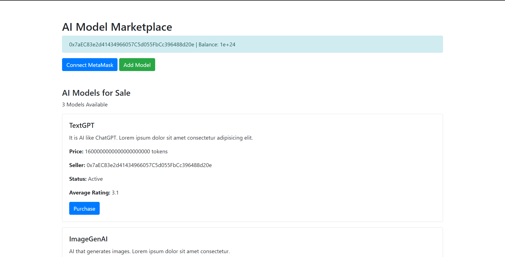
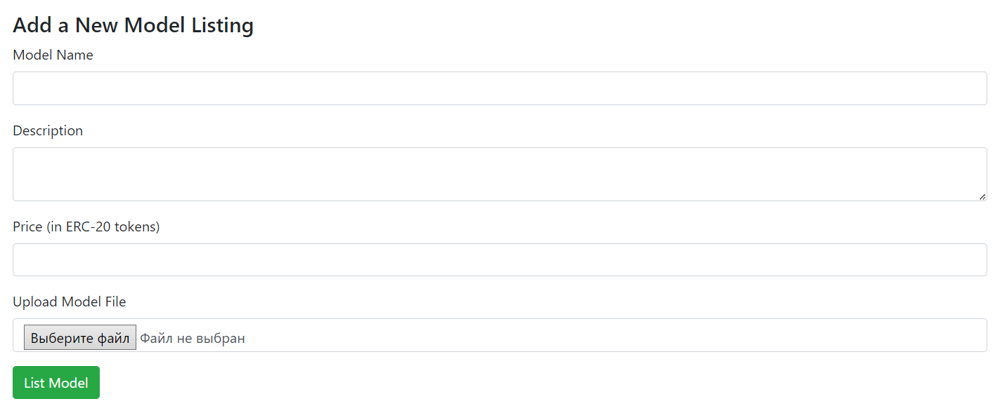
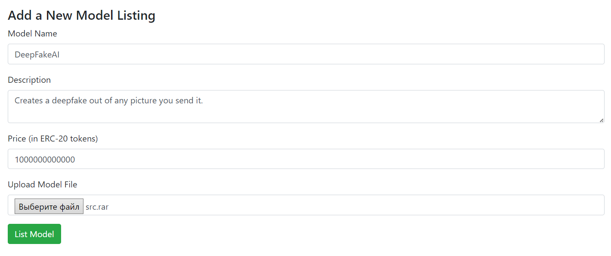
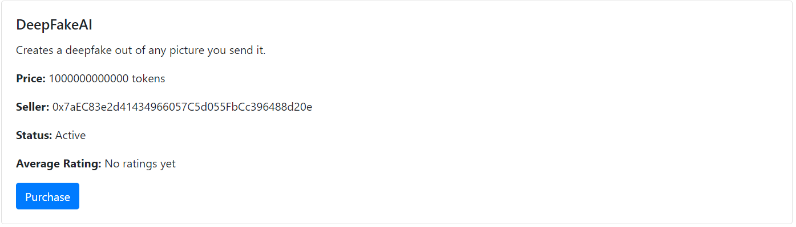
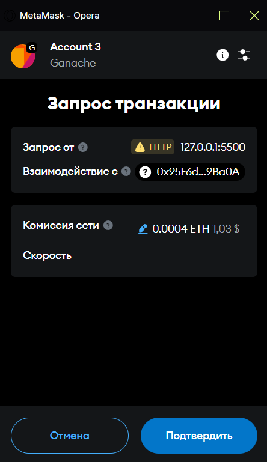

# AI Model Marketplace

This project is a blockchain-based marketplace for AI models, allowing users to buy and sell models using ERC-20 tokens. The marketplace is built using Solidity, Web3, and Hardhat, with integration for wallet connectivity and token transactions.



## Prerequisites

- Ensure you have the following installed:
- Node.js (v16 or later)
- Hardhat
- MetaMask

## Installation

Clone the repository and install dependencies:
```
git clone https://github.com/riqqer/AI-Marketplace.git
cd AI-Marketplace
npm install
```

## Smart Contract Deployment

### 1. Start a local blockchain (Hardhat)
```
npx hardhat node
```
### 2. Deploy the Smart Contract
```
npx hardhat run scripts/deploy.js --network localhost
```
Select the deployed Token Address and Marketpalce Address from the console and insert it into the app.js:
```
const tokenAddress = "TOKEN_ADDRESS";
const marketplaceAddress = "MARKETPLACE_ADDRESS";
```

## Usage
### List a Model: Upload AI models and set a price in ERC-20 tokens.



New listed model will appear immediately after clicking "List Model" button.


## Example

When listing a new model into the listing, the user has to approve their action in Metamask, as shown in the example below:



## Licence
This project is licensed under the [MIT License](license).